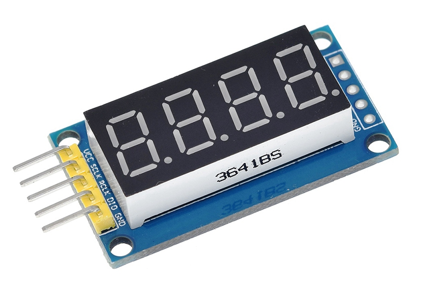
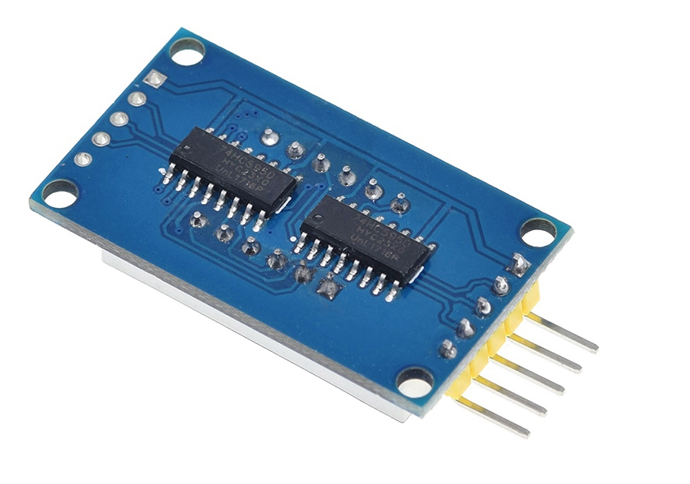

## Table of contents
* [General info](#general-info)
* [Technologies](#technologies)
* [Setup](#setup)
* [Start](#start)

## General info
Script for displaying the current time on a 4-digit 7-segment display with a 74hc595 chip.
74HCT595 is an 8-bit serial-in/serial or parallel-out shift register with a storage register and 3-state outputs.


	
## Technologies
The script is written for:
* Python3
* module RPi.GPIO
	
## Setup
```
NONE
```

## Start
The script is run in command line mode:
```
$ python3 display_74hc595.py
```
